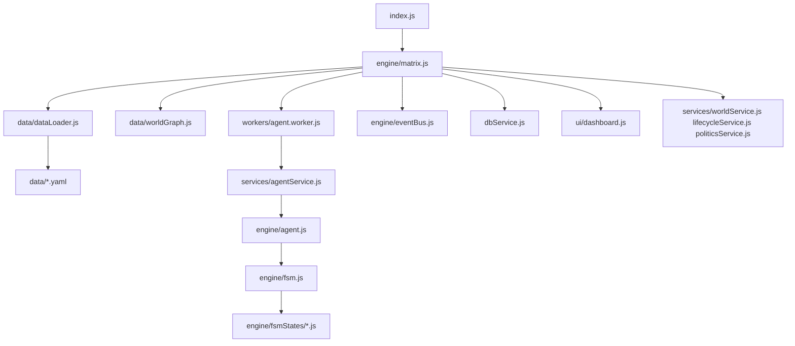
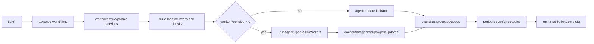
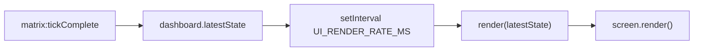

# NYC 1999 Architecture

This document captures the current simulation architecture before the simplification and security review. It is intended as a preservation map: future refactors should keep the behaviors documented here unless a backlog card explicitly removes or changes them.

## System Overview

NYC 1999 is a Node.js ES modules terminal simulation. `index.js` boots `Matrix`, `Matrix` owns the simulation loop, worker pool, persistence, world state, and dashboard wiring, and agents advance through a finite state machine composed of state classes and small behavior trees.

## Runtime Flow

1. `index.js` parses CLI flags (`--agents=N`, `--headless`, `--debug`, `--help`), optionally sets environment variables, constructs `Matrix`, calls `init()`, and starts the loop.
2. `Matrix.init()` loads YAML data, initializes `worldGraph`, hydrates the world, opens SQLite through `DbService`, creates or loads agents through `CacheManager`, sets globals, and starts worker threads.
3. `Matrix._runLoop()` repeatedly calls `tick()` while running, with adaptive pacing and pause support.
4. `Matrix.tick()` advances time, updates weather/world/lifecycle/politics, builds location peer maps, updates agents in workers, processes events, syncs/checkpoints SQLite, and emits `matrix:tickComplete`.
5. `Dashboard` listens to `matrix:tickComplete` and renders a blessed terminal UI on its own interval.

## Tick Pipeline

The authoritative tick work is in `engine/matrix.js`.

Important implementation details:

- Time begins at `1999-01-01T08:00:00` and advances by `MINUTES_PER_TICK`.
- `locationPeers` gives each agent same-location social context for perception.
- Worker partitions are location-based and periodically rebalanced.
- If the worker pool is empty, `Matrix` falls back to calling `agent.update()` directly.
- Persistence uses SQLite (`better-sqlite3`) with dirty-agent sync and checkpoints.
- `eventBus` is the cross-cutting queue/history/profiling mechanism.

## Agent Update Architecture

There are two live paths:

- Worker path: `workers/agent.worker.js` hydrates agents, calls `services/agentService.js`, executes `agent.fsm.tick()`, serializes selected fields back to the main thread, and `cacheManager.mergeAgentUpdates()` patches the main-thread agents.
- Fallback path: `Matrix.tick()` calls `Agent.update()` when no workers are available.

The paths are not equivalent and are now a top-priority review finding. The worker path relies on `BaseState.tick()` for biological decay, while the fallback path calls `Agent._decayStats()` before entering the FSM. Sleeping, perception, status effects, and transit behavior also differ.

## FSM And Behavior Trees

`engine/fsm.js` defines a registry of state names and aliases. States are represented by classes under `engine/fsmStates/`:

- `IdleState`
- `SleepingState`
- `EatingState`
- `WorkingState`
- `ShoppingState`
- `SocializingState`
- `RecreationState`
- `MaintenanceState`
- `CommutingState`
- `AcquireHousingState`
- `DesperateState`
- `RetiredState`

Most states follow this shape:

1. `enter(agent, params)` sets up `agent.stateContext` and a current activity.
2. `tick(agent, hour, localEnv, worldState)` calls `super.tick()` for shared biological/emotional effects.
3. A behavior tree from `engine/BehaviorTreeCore.js` selects actions.
4. The state returns dirty/WAL/transition data to the FSM.

`BaseState.tick()` is currently the dominant biological model. It treats high `social` as good connection and subtracts social decay over time. `Agent._decayStats()` uses a different model for `social`, which is part of the current correctness review.

## Module Inventory

### Root

| File | Responsibility |
| --- | --- |
| `index.js` | CLI args, graceful shutdown, headless input, Matrix bootstrap |
| `dbService.js` | SQLite persistence, checkpoints, memories, health checks, backup/recovery workers |
| `logger.js` | Winston file logs and optional headless console logs |
| `package.json` | ESM package metadata; only `npm start` script |
| `docker-compose.yml` | Postgres/Redis/pgAdmin stack, not wired to `npm start` runtime |

### Engine

| File | Responsibility |
| --- | --- |
| `engine/matrix.js` | Main orchestrator, tick loop, worker pool, persistence scheduling, dashboard events |
| `engine/agent.js` | Agent model, hydration, stats, relationships, activity history, FSM ownership |
| `engine/fsm.js` | FSM registry, transitions, lizard-brain interruptions |
| `engine/cacheManager.js` | In-memory agent cache, dirty tracking, worker update merge, departure cleanup |
| `engine/eventBus.js` | Priority event queue, audit history, batching, profiling |
| `engine/agentUtilities.js` | Agent generation, job-to-work-tag mapping, location scoring, commute helpers |
| `engine/BehaviorTreeCore.js` | Stateless behavior-tree primitives |
| `engine/worldSeeder.js` | Hydrates world graph with names, rents, affordances, hours |
| `engine/worldPartitioner.js` | Location partitioning for workers |
| `engine/agent/agentActivity.js` | YAML activity resolution by FSM tag and current location type |
| `engine/agent/agentInventory.js` | Inventory and consumable item helpers |
| `engine/structures/PriorityQueue.js` | Generic heap; currently appears unused |

### FSM States

| File | Responsibility |
| --- | --- |
| `engine/fsmStates/BaseState.js` | Shared passive need decay, stress/mood consequences, activity helpers |
| `engine/fsmStates/IdleState.js` | Main dispatcher for needs, work, routines, outings, and commute decisions |
| `engine/fsmStates/WorkingState.js` | Work session, wages, work flavor, lunch, burnout/slacking |
| `engine/fsmStates/CommutingState.js` | Pathfinding and hop-by-hop travel |
| `engine/fsmStates/SocializingState.js` | In-person/digital social interactions |
| `engine/fsmStates/ShoppingState.js` | Shopping strategy and purchases |
| `engine/fsmStates/EatingState.js` | Eating and hunger recovery |
| `engine/fsmStates/SleepingState.js` | Sleep recovery and wake conditions |
| `engine/fsmStates/RecreationState.js` | Recreation duration and exit behavior |
| `engine/fsmStates/MaintenanceState.js` | Home maintenance chores |
| `engine/fsmStates/AcquireHousingState.js` | Homeless housing search |
| `engine/fsmStates/DesperateState.js` | Starvation/survival mode |
| `engine/fsmStates/RetiredState.js` | Retired agent leisure/needs |

### Data

| File | Responsibility |
| --- | --- |
| `data/dataLoader.js` | Loads runtime YAML files and builds exported maps/catalogs |
| `data/worldGraph.js` | Runtime graph, node lookup, pathfinding, dynamic modifiers |
| `data/config.js` | Environment-driven engine/UI/system settings |
| `data/balance.js` | Gameplay constants and tuning numbers |
| `data/location_graph.yaml` | Main world graph nodes and edges |
| `data/activities.yaml` | Activity tags, actions, duration, and allowed location types |
| `data/demographics.yaml` | Names, jobs, education, interests, personality data |
| `data/locations.yaml` | Named locations by type |
| `data/economics.yaml` | Typical prices used for activity costs |
| `data/culture.yaml` | Cultural flavor data |
| `data/events.yaml` | Calendar events, random events, world event modifiers |
| `data/crowd_schedules.yaml` | Location crowd schedules |
| `data/weather_patterns.yaml` | Weighted weather patterns |
| `data/dialogue.yaml` | Phrase library |
| `data/politics.yaml` | Parties, offices, campaigns, officeholders |
| `data/world_data.yaml` | Extra location names; not loaded by runtime dataLoader |
| `data/sensory.yaml` | Weather/time-of-day sensory copy; not loaded by runtime dataLoader |

### Services, Workers, UI

| File | Responsibility |
| --- | --- |
| `services/agentService.js` | Worker-side agent tick coordinator |
| `services/perceptionService.js` | Agent environment perception |
| `services/socialService.js` | Agent social interactions |
| `services/worldService.js` | Weather, news, economy, business/rent/world events |
| `services/lifecycleService.js` | Aging, death, pregnancy, birth, marriage, divorce, migration |
| `services/politicsService.js` | Elections, campaigns, political state and multipliers |
| `workers/agent.worker.js` | Worker-thread entry point and IPC serialization |
| `ui/dashboard.js` | Blessed dashboard, agent inspector, world/politics/log/profiler panels |

## Data Loading

`data/dataLoader.js` loads these runtime files in parallel:

- `demographics.yaml`
- `locations.yaml`
- `economics.yaml`
- `culture.yaml`
- `events.yaml`
- `location_graph.yaml`
- `activities.yaml`
- `crowd_schedules.yaml`
- `weather_patterns.yaml`
- `dialogue.yaml`
- `politics.yaml`

Missing, empty, or invalid YAML files are fatal to startup. Activity location types are validated against graph node types, but unknown types currently produce warnings rather than failing fast. There is no full schema validation for most YAML structures.

`world_data.yaml` and `sensory.yaml` exist but are not loaded by `dataLoader.js`. They should be either integrated or retired through explicit backlog cards.

## Configuration

Runtime config is split across:

- `data/config.js`: environment-derived engine settings such as tick rate, UI render rate, population, persistence intervals, lifecycle toggles, diagnostics, and thought logging.
- `data/balance.js`: gameplay numbers for needs, regen, economy, thresholds, lifecycle, politics, and world simulation.
- `index.js`: CLI flags for agents/headless/debug/help.
- `dbService.js`: `DB_CACHE_SIZE_KB`.
- `config.env`: a local config-style file, currently not loaded because no source imports `dotenv/config` or calls `dotenv.config()`.

Current config risk: numeric environment parsing uses `parseInt`/`parseFloat` without a safe fallback if the value is malformed.

## Dashboard Architecture

`ui/dashboard.js` is a blessed/blessed-contrib terminal dashboard. It renders:

- Header with time, tick, population, lifecycle stats, average needs, and controls.
- World/activity box with weather, economy, civic status, news, calendar, and events.
- Agent list with selected/focused agent support.
- Agent detail panel with vitals, memories, relationships, plans, inventory, and history.
- Politics panel.
- System log or event profiler view.

The render loop is decoupled from the simulation tick:

Known UI invariants:

- Programmatic list selection during observer mode sets `_suppressSelectEvent` so the `select item` handler does not recursively render or disable observer mode.
- Agent-list indices are clamped when the focus cache changes size.
- Headless CLI input is only enabled outside TUI mode to avoid fighting blessed stdin handling.

## Persistence

Runtime persistence is SQLite through `better-sqlite3` in `dbService.js`.

Key behaviors:

- Creates tables for agents, checkpoints, simulation events, memories, WAL-style operations, and related runtime data.
- Uses WAL mode and periodic sync/checkpoints.
- Writes `debug.log` and `error.log` through Winston.
- Has backup/recovery worker logic implemented with inline worker code and `{ eval: true }`.
- Reads checkpoint JSON through `JSON.parse` without structural schema validation.

The docker/Postgres path (`docker-compose.yml`, `db/schema.sql`, `scripts/genesis.js`) is currently disconnected from `npm start`, which uses SQLite.

## Current Review Hotspots

These are architecture-level findings already confirmed and should be treated as backlog seeds:

- `Matrix` is a god object that owns simulation orchestration, workers, persistence cadence, lifecycle/politics hooks, dashboard updates, graph snapshots, and adaptive pacing.
- Worker and fallback agent update paths have behavioral drift.
- Biological decay exists in both `Agent._decayStats()` and `BaseState.tick()` with different `social` semantics.
- Worker IPC serializes `stateContext`, `shortTermMemory`, and `plans`, but `CacheManager.mergeAgentUpdates()` does not merge all serialized fields.
- `config.env` does not affect runtime without dotenv wiring.
- Several files or branches are dead/stub/orphaned (`PriorityQueue`, `_processSenses`, `_updateStatusEffectsStub`, `updateRoutineReinforcement`, old transit branch, Postgres genesis stack).
- Runtime data has no comprehensive schema validation.
- Global mutable state (`global.dashboard`, `global.cacheManager`, `global.currentTick`, `global.worldTime`, `global.SimulationError`) makes testing and dependency boundaries harder.
