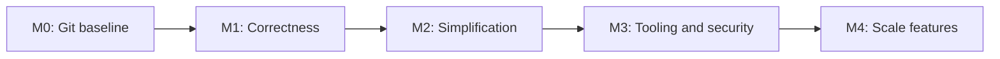

# NYC 1999 Project Plan

This plan consolidates the current-state review, the prior roadmap, and the review findings into an execution sequence for scaling the simulation safely.

Primary goals:

1. Simplify without losing features.
2. Apply best practices and secure-code foundations.
3. Preserve current simulation behavior through documentation, tests, and explicit backlog cards.

## Current State

The simulation is a Node.js ES modules terminal simulation. The core architecture is:

- `index.js` bootstraps the app and handles process-level shutdown.
- `engine/matrix.js` orchestrates ticks, workers, persistence, world services, and dashboard events.
- `workers/agent.worker.js` updates agent partitions.
- `services/agentService.js` coordinates worker-side agent updates.
- `engine/fsm.js` and `engine/fsmStates/*.js` drive agent behavior.
- `data/dataLoader.js` and `data/*.yaml` provide data-driven content.
- `dbService.js` persists agents, memories, events, and checkpoints in SQLite.
- `ui/dashboard.js` renders the blessed terminal UI.

Current state is captured in:

- `Docs/ARCHITECTURE.md`
- `Docs/FEATURES.md`
- `Docs/ReviewFindings.md`
- `Docs/KANBAN.md`

## Guiding Rules

- No behavior-changing refactor should begin without a no-regression checklist from `Docs/FEATURES.md`.
- Correctness bugs that alter simulation truth take priority over aesthetic simplification.
- Simplify by removing duplicate ownership and stale code, not by removing features.
- Add tests around invariants before changing high-risk systems.
- Prefer small commits and small PRs once git hosting exists.
- Do not add new roadmap features until the correctness and tooling milestones are complete.

## Milestone 0: Repository Baseline

Goal: make all future work diffable and reviewable.

Scope:

- Initialize git.
- Add `.gitignore` for dependencies, logs, local databases, SQLite sidecars, and local env files.
- Create a baseline commit of the existing simulator.
- Create a documentation commit after this review package.

Definition of done:

- `git status` is clean.
- `node_modules/`, logs, DB files, and local env files are ignored.
- Documentation artifacts are committed separately from runtime changes.

Related cards:

- REV-026

## Milestone 1: Correctness Stabilization

Goal: remove sources of divergent simulation truth before doing broader simplification.

Priority work:

1. Unify agent update paths.
2. Consolidate biological decay semantics.
3. Fix worker IPC field coverage.
4. Define `stateContext` ownership and lifecycle.
5. Clarify commute/transit ownership.
6. Fix the dashboard inventory catalog lookup.
7. Add a bounded headless smoke test.

Definition of done:

- Worker and fallback updates produce equivalent outcomes for representative states.
- Need/stat decay has one documented model.
- Worker serialized fields and merge fields have a contract test.
- Social conversation context, work session flags, shopping plans, and commute context survive worker round trips.
- Dashboard inventory displays catalog names when item definitions exist.
- A smoke test can boot the simulation with a small population and exit cleanly.

Related cards:

- REV-001
- REV-002
- REV-003
- REV-011
- REV-016
- REV-023
- REV-030

## Milestone 2: Simplification Without Feature Loss

Goal: make the codebase easier to change while preserving the feature inventory.

Priority work:

1. Split `Matrix` responsibilities.
2. Decompose `IdleState` decision logic.
3. Standardize behavior-tree state boilerplate.
4. Normalize FSM alias handling.
5. Move job-title-to-work-tag mapping to a tested table or data file.
6. Remove or implement dead/stub code.
7. Extract dashboard formatting and panel rendering helpers.
8. Decide the fate of disconnected Postgres/docker/data artifacts.

Definition of done:

- `Matrix` delegates worker orchestration and persistence cadence to smaller modules.
- `IdleState` behavior order remains unchanged and is covered by tests.
- State classes are easier to scan and share standard execution logic where appropriate.
- Every working tag emitted by the job mapping exists in `activities.yaml`.
- Dead stubs are gone or explicitly tracked.
- Dashboard observer-mode invariants still hold.
- Disconnected artifacts are either integrated, moved to an experiments/future area, or removed.

Related cards:

- REV-004
- REV-006
- REV-007
- REV-008
- REV-009
- REV-010
- REV-012
- REV-013
- REV-018
- REV-022
- REV-024

## Milestone 3: Tooling, Tests, And Secure Code

Goal: add the safety net needed for larger scaling work.

Priority work:

1. Add Node version policy (`engines` and/or `.nvmrc`).
2. Add scripts for `start`, `start:headless`, `check`, `test`, `lint`, and audit/security review.
3. Add minimal test infrastructure, preferably with built-in `node:test` first.
4. Add config parse helpers with bounds and finite-value fallback.
5. Decide and document dotenv/config-file behavior.
6. Move inline DB worker code into worker files.
7. Add schema validation for persisted JSON and runtime YAML data.
8. Reduce or document process exits outside `index.js`.
9. Document dependency and docker credential risks.

Definition of done:

- `npm test` and `npm run check` exist.
- Config parsing handles malformed env values.
- Runtime config behavior is documented and matches implementation.
- DB backup/recovery workers are static files, not inline eval strings.
- Persisted agent/checkpoint payloads are validated before hydration.
- YAML data errors fail fast where appropriate.
- Dependency audit process is documented.

Related cards:

- REV-014
- REV-015
- REV-017
- REV-019
- REV-020
- REV-021
- REV-025
- REV-027
- REV-028
- REV-029

## Milestone 4: Scale-Ready Simulation Enhancements

Goal: resume feature growth after the foundation is stable.

This milestone carries forward still-valid items from the previous roadmap, but they should not begin until Milestones 1-3 are substantially complete.

Candidate work:

- Movement interpolation and explicit travel durations.
- Location capacity and crowding limits.
- Pathfinding cache with invalidation.
- Statistical LOD2 behavior that preserves believable needs when agents re-enter focus.
- Persistent memories, relationships, and plans with decay and cleanup.
- Multi-step goal stack or planner for needs such as shopping, cooking, meeting friends, and commute chains.
- Expanded inventory/items.
- Dynamic world events that modify affordances and travel.
- Agent inspector improvements showing active plans, top decision reasons, and recent memories.
- User-facing time controls and observability views, if not already complete.

Definition of done:

- New feature work has tests or smoke coverage proportional to risk.
- Feature additions reference `Docs/FEATURES.md` and update it when behavior changes.
- Large AI architecture changes are planned separately before implementation.

## Workstream Order

## Review Cadence

- Keep `Docs/KANBAN.md` as the working board.
- Move only one or two high-risk cards into "In Progress" at a time.
- For each implementation card, state which feature inventory entries must remain unchanged.
- After each milestone, run smoke/tests and update `Docs/FEATURES.md` if behavior intentionally changed.

## Open Decisions

- Whether `config.env` should become the supported local config file or be removed in favor of shell environment variables.
- Whether the Postgres/Redis stack is future architecture, an experiment, or abandoned.
- Whether `blessed` remains the long-term UI platform or is treated as an accepted local-only risk.
- Whether behavior-tree/GOAP changes should be deferred until after the current FSM is stabilized and tested.
